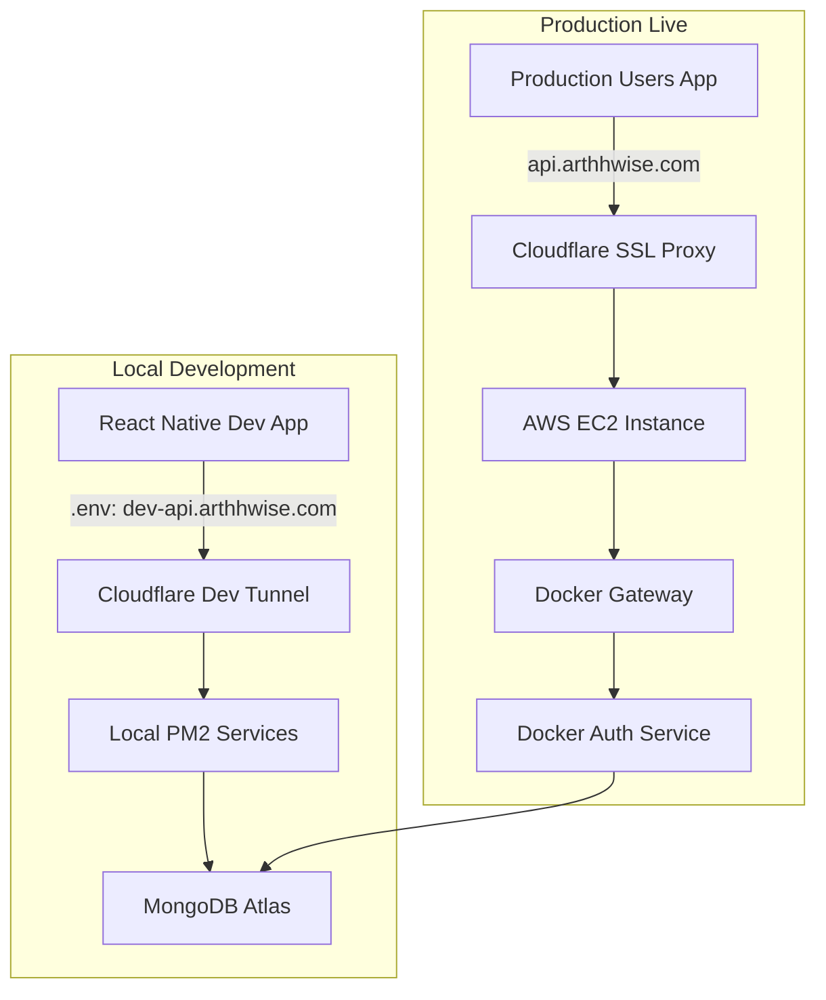

# Deploy ArthwiseServices to AWS with Docker

## Background & Problem

Your Arthwise backend currently runs as **3 PM2 services** on your local machine, exposed via a Cloudflare Tunnel:

| Service | Language | Port | Role |
|---|---|---|---|
| **Gateway** (`index.js`) | Node.js (ES module) | 3000 | Reverse proxy → auth + NSE services, FCM, dashboard, news |
| **Auth Service** (`auth_microservice/index.js`) | Node.js (CommonJS + ts-node) | 8000 | Auth, portfolio, contests, orders, Socket.io, schedulers |
| **NSE Service** (`nse_service/main.py`) | Python 3 (FastAPI/Uvicorn) | 8001 | Live stock data, market status, F&O, option chain |

External dependencies (remain unchanged):
- **MongoDB Atlas** — Cloud-hosted, connection string in `.env`
- **Redis** — Currently local; will run as a Docker container alongside services
- **Firebase** — Push notifications (`serviceAccountKey.json` — currently missing, FCM degrades gracefully)

**AI/Ollama**: Excluded from this deployment. The `AI_SERVICE_URL` env var will not be set.

---

## Decisions (Based on Your Feedback)

| Decision | Choice |
|---|---|
| AWS Account | Existing account |
| Instance Type | `t2.micro` (1 vCPU, 1 GB RAM), upgrade later if needed |
| Domain/HTTPS during dev | **No DNS changes** — test via EC2 IP directly. Production (`api.arthhwise.com`) stays on Cloudflare Tunnel undisturbed |
| Domain/HTTPS at cutover | Update Cloudflare DNS A-record to Elastic IP only after full verification |
| AI/Ollama | Skipped — not deployed |
| Secrets | `.env` file on server, never committed |
| Landing Page | Skipped for now — Android app only hits API routes. Gateway landing-page proxy will 502 harmlessly |

---

## Proposed Changes

The plan is divided into **6 phases**. Each phase is self-contained with clear verification steps.

---

### Phase 1: Fix & Create Production-Ready Dockerfiles

The existing Dockerfiles are minimal stubs. We need proper production builds.

---

#### [MODIFY] [Dockerfile](file:///Users/saurabhpatel/Documents/Arthwise/ArthwiseServices/Dockerfile) (Gateway)

Current file only copies `package.json` and runs `node index.js` with Node 18. Needs:
- Node 20 base (per README)
- Proper `.dockerignore` to exclude auth/nse subdirectories
- Health check
- Only copy gateway-relevant source files

---

#### [MODIFY] [Dockerfile](file:///Users/saurabhpatel/Documents/Arthwise/ArthwiseServices/auth_microservice/Dockerfile) (Auth Microservice)

Current uses `node:18-alpine` and `npm start`. Needs:
- Node 20
- `ts-node` in production deps (required by start command)
- `CMD ["node", "-r", "ts-node/register", "index.js"]`
- Health check

---

#### [MODIFY] [Dockerfile](file:///Users/saurabhpatel/Documents/Arthwise/ArthwiseServices/nse_service/Dockerfile) (NSE Service)

Current uses `python:3.9-slim`. Needs:
- Python 3.10+ (per README)
- System deps for pandas/numpy compilation (gcc)
- Updated requirements (you removed `nsepython` and `nse`)
- Health check

---

#### [MODIFY] [.dockerignore](file:///Users/saurabhpatel/Documents/Arthwise/ArthwiseServices/.dockerignore)

Expand exclusion list to keep images small and secure.

---

#### [MODIFY] [docker-compose.yml](file:///Users/saurabhpatel/Documents/Arthwise/ArthwiseServices/docker-compose.yml)

Rewrite for production AWS deployment:
- Remove local MongoDB (uses Atlas)
- Redis as lightweight container (100 MB limit, alpine image)
- Docker networking (services communicate by container name)
- Environment variable injection via `.env` file
- Restart policies, health checks, memory limits
- Gateway port 3000 exposed to host

---

#### [NEW] [.env.production](file:///Users/saurabhpatel/Documents/Arthwise/ArthwiseServices/auth_microservice/.env.production)

Production env template (copied from your existing `.env` with sensitive values masked). Will NOT be committed to git.

---

### Phase 2: AWS EC2 Setup

> [!NOTE]
> You have an existing AWS account. These steps use the AWS Console.

#### Step 2.1 — Launch EC2 Instance
1. **AWS Console** → **EC2** → **Launch Instance**
2. Settings:
   - **Name**: `arthwise-backend`
   - **AMI**: Amazon Linux 2023 (free tier eligible)
   - **Instance type**: `t2.micro`
   - **Key pair**: Create new → `arthwise-key` → Download `.pem` → **KEEP SAFE**
   - **Network settings**:
     - ✅ Allow SSH from **My IP** only
     - ✅ Allow HTTP (port 80) from Anywhere
     - ✅ Allow HTTPS (port 443) from Anywhere
     - ✅ Add custom TCP: port **3000** from Anywhere (dev testing)
   - **Storage**: 20 GB gp3

#### Step 2.2 — Allocate Elastic IP (Free when attached)
1. **EC2** → **Elastic IPs** → **Allocate**
2. Select IP → **Actions** → **Associate** → Choose `arthwise-backend`
3. **Note this IP** — your permanent server address

#### Step 2.3 — SSH In
```bash
chmod 400 ~/Downloads/arthwise-key.pem
ssh -i ~/Downloads/arthwise-key.pem ec2-user@<ELASTIC-IP>
```

---

### Phase 3: Install Docker on EC2

#### [NEW] [setup-ec2.sh](file:///Users/saurabhpatel/Documents/Arthwise/ArthwiseServices/ops/aws/setup-ec2.sh)

Script to run on EC2 — installs Docker, Docker Compose v2, and Git:

```bash
#!/bin/bash
set -e
echo "=== Arthwise EC2 Setup ==="
sudo dnf update -y
sudo dnf install -y docker git
sudo systemctl start docker && sudo systemctl enable docker
sudo usermod -aG docker ec2-user

# Docker Compose v2
sudo mkdir -p /usr/local/lib/docker/cli-plugins
sudo curl -SL "https://github.com/docker/compose/releases/latest/download/docker-compose-linux-$(uname -m)" \
  -o /usr/local/lib/docker/cli-plugins/docker-compose
sudo chmod +x /usr/local/lib/docker/cli-plugins/docker-compose

sudo mkdir -p /opt/arthwise && sudo chown ec2-user:ec2-user /opt/arthwise
echo "=== Done! Log out and back in for docker group ==="
```

---

### Phase 4: Deploy to EC2

#### [NEW] [deploy.sh](file:///Users/saurabhpatel/Documents/Arthwise/ArthwiseServices/ops/aws/deploy.sh)

Run **from your Mac** to sync code and build containers:

```bash
#!/bin/bash
set -e
EC2_HOST="ec2-user@<ELASTIC-IP>"
EC2_KEY="~/Downloads/arthwise-key.pem"
REMOTE_DIR="/opt/arthwise/ArthwiseServices"

rsync -avz --progress \
  --exclude 'node_modules' --exclude 'venv' --exclude '__pycache__' \
  --exclude '.git' --exclude '*.tar.gz' --exclude 'android-transfer' \
  --exclude 'temp' --exclude 'logs' --exclude '.next' --exclude 'dist' \
  -e "ssh -i $EC2_KEY" . "$EC2_HOST:$REMOTE_DIR"

ssh -i "$EC2_KEY" "$EC2_HOST" << 'REMOTE'
  cd /opt/arthwise/ArthwiseServices
  docker compose build --no-cache
  docker compose down 2>/dev/null || true
  docker compose up -d
  sleep 15
  docker compose ps
  echo "=== Health Checks ==="
  curl -sf http://localhost:3000/healthz && echo " ✅ Gateway" || echo " ❌ Gateway"
  curl -sf http://localhost:8000/health && echo " ✅ Auth" || echo " ❌ Auth"
  curl -sf http://localhost:8001/ && echo " ✅ NSE" || echo " ❌ NSE"
REMOTE
echo "✅ Deploy done! Test: curl http://<ELASTIC-IP>:3000/healthz"
```

---

### Phase 5: HTTPS & Domain (ONLY After Full Verification)

> [!IMPORTANT]
> **This phase is executed LAST**, only after everything works on the EC2 IP. Your existing production on Cloudflare Tunnel stays live until you explicitly switch.

#### [NEW] [nginx.conf](file:///Users/saurabhpatel/Documents/Arthwise/ArthwiseServices/ops/aws/nginx.conf)

Nginx reverse proxy for WebSocket support and proper headers.

**Cloudflare DNS Cutover Steps** (only when ready):
1. Cloudflare Dashboard → `arthhwise.com` → DNS
2. Change `api` record: **Type** = A, **Content** = `<ELASTIC-IP>`, **Proxy** = ✅ (orange cloud)
3. Wait 5 min → test: `curl https://api.arthhwise.com/healthz`

---

### Phase 6: Connect Android Dev App

**During dev testing** (before DNS switch):
```
EXPO_PUBLIC_API_URL=http://<ELASTIC-IP>:3000
```

**After DNS cutover** (no change needed — existing value works):
```
EXPO_PUBLIC_API_URL=https://api.arthhwise.com
```

---

## Rollback Plan

> [!CAUTION]
> This is your safety net. At every step, your existing production remains live.

### During Development (Phases 1–4)
- **No risk**: Production DNS still points to Cloudflare Tunnel → your local PM2 setup
- Android dev app can test via `http://<EC2-IP>:3000` in parallel
- If EC2 has issues, nothing is affected — just stop the containers

### During DNS Cutover (Phase 5)
If anything goes wrong after switching DNS:

| Step | Action | Time to Recover |
|---|---|---|
| 1 | Revert Cloudflare DNS: change `api` A-record back to Tunnel CNAME | ~2 min |
| 2 | Start local PM2: `pm2 start ecosystem.config.cjs` | ~30 sec |
| 3 | Verify: `curl https://api.arthhwise.com/healthz` | ~5 min (DNS propagation) |
| **Total** | | **< 8 minutes** |

### Emergency Commands on EC2
```bash
# View what's happening
docker compose logs --tail=100

# Restart all containers
docker compose restart

# Stop everything
docker compose down

# Nuclear: remove all and rebuild
docker compose down -v
docker compose build --no-cache
docker compose up -d
```

### Data Safety
- **MongoDB Atlas**: Untouched — EC2 only reads/writes to Atlas, same as PM2 does today
- **Redis**: Ephemeral cache only — losing it just means cold caches, no data loss
- **No migration needed**: Same database, same connection string

---

## File Summary

| File | Action | Description |
|---|---|---|
| [Dockerfile](file:///Users/saurabhpatel/Documents/Arthwise/ArthwiseServices/Dockerfile) | MODIFY | Production gateway Dockerfile (Node 20, health check) |
| [auth Dockerfile](file:///Users/saurabhpatel/Documents/Arthwise/ArthwiseServices/auth_microservice/Dockerfile) | MODIFY | Production auth Dockerfile (ts-node, health check) |
| [nse Dockerfile](file:///Users/saurabhpatel/Documents/Arthwise/ArthwiseServices/nse_service/Dockerfile) | MODIFY | Production NSE Dockerfile (Python 3.10, updated deps) |
| [.dockerignore](file:///Users/saurabhpatel/Documents/Arthwise/ArthwiseServices/.dockerignore) | MODIFY | Expanded exclusion list |
| [docker-compose.yml](file:///Users/saurabhpatel/Documents/Arthwise/ArthwiseServices/docker-compose.yml) | MODIFY | Production compose (Redis, health checks, memory limits) |
| [.env.production](file:///Users/saurabhpatel/Documents/Arthwise/ArthwiseServices/auth_microservice/.env.production) | NEW | Production env template |
| [setup-ec2.sh](file:///Users/saurabhpatel/Documents/Arthwise/ArthwiseServices/ops/aws/setup-ec2.sh) | NEW | EC2 initial setup script |
| [deploy.sh](file:///Users/saurabhpatel/Documents/Arthwise/ArthwiseServices/ops/aws/deploy.sh) | NEW | Deploy script (from Mac) |
| [nginx.conf](file:///Users/saurabhpatel/Documents/Arthwise/ArthwiseServices/ops/aws/nginx.conf) | NEW | Nginx reverse proxy config |

---

## Verification Plan

### After Phase 4 (Dev Testing via EC2 IP)
```bash
# From Mac — test all endpoints
curl http://<ELASTIC-IP>:3000/healthz          # Gateway
curl http://<ELASTIC-IP>:3000/api/user/health   # Auth via gateway
curl http://<ELASTIC-IP>:3000/api/market-status  # NSE via gateway

# On EC2 — check container status
docker compose ps
docker compose logs --tail=50
```

### Android App Dev Testing
1. Update `clientapp/.env`: `EXPO_PUBLIC_API_URL=http://<ELASTIC-IP>:3000`
2. Rebuild dev APK
3. Test: Login → Portfolio → Contests → Stock Search → Real-time updates

### After Phase 5 (Production Cutover)
1. `curl https://api.arthhwise.com/healthz`
2. Test Android production app — all features should work identically
3. Monitor: `ssh` into EC2 → `docker compose logs -f`

---

## Cost Estimate

| Resource | Cost |
|---|---|
| EC2 t2.micro (750 hrs/mo Free Tier) | **$0** |
| Elastic IP (attached to running instance) | **$0** |
| EBS 20 GB gp3 | **$0** (Free Tier) |
| Data transfer (first 100 GB/mo) | **$0** (Free Tier) |
| Cloudflare (free plan) | **$0** |
| **Total** | **$0/month** (within Free Tier limits) |

> [!NOTE]
> Free Tier limits: 750 hrs/month of t2.micro. Since a month has ~730 hrs, running 1 instance 24/7 stays within limits. If you already have other EC2 instances running, the hours are shared across all t2.micro instances.

---

## Firebase Note

The `serviceAccountKey.json` file is **not present** in your repo. Both services handle this gracefully:
- **Auth service**: Logs `⚠️ [Push] serviceAccountKey.json not found, FCM will not be available` and continues
- **Gateway**: Falls back to env-based credentials or logs a warning

FCM push notifications won't work until you provide the key file. You can add it later by:
1. Download from Firebase Console → Project Settings → Service Accounts → Generate Private Key
2. Place it at `ArthwiseServices/serviceAccountKey.json` (for gateway) and `ArthwiseServices/auth_microservice/serviceAccountKey.json` (for auth)
3. Redeploy: `./ops/aws/deploy.sh`

---

## Phase 7: AWS Monitoring & Alerts

To keep your application stable, healthy, and cost-efficient, we recommend setting up three types of monitoring. All of these fit within the **AWS Free Tier**:

### 7.1 — AWS Cost & Budget Alerts (Highly Recommended)
Prevent unexpected charges by setting up an AWS Budget:
1. Go to the **AWS Billing Console** → **Budgets**.
2. Click **Create budget** → select **Cost budget (Recommended)**.
3. Budget settings:
   - **Period**: Monthly.
   - **Budget limit**: Set to `$10.00` (per your preference).
4. Configure threshold alerts:
   - **Alert #1**: Trigger at **80%** of budgeted amount (Actual) → Sends email.
   - **Alert #2**: Trigger at **100%** of budgeted amount (Forecasted) → Sends email.
5. This ensures you get an email *before* you are billed for exceeding your budget!

### 7.2 — Compute Power (CPU & Disk) Alerts
Set up CloudWatch Alarms to monitor your EC2 instance's health:
1. Go to the **AWS CloudWatch Console** → **Alarms** → **In alarm** → **Create alarm**.
2. Click **Select metric** → **EC2** → **Per-Instance Metrics** → Choose `CPUUtilization` for your `arthwise-backend` instance.
3. Define Alarm Conditions:
   - **Threshold type**: Static.
   - **Condition**: Greater than `85%`.
   - **Period**: `15 minutes`.
4. Configure Action:
   - Select **In alarm**.
   - Send notification to a **new or existing SNS topic** (configured with your email address).
5. Click **Create Alarm**. You will get an email if the server's CPU spikes heavily for an extended duration.

### 7.3 — Instant API Failure Monitoring (Free & Easiest)
CloudWatch is good for hardware, but the easiest and most reliable way to monitor if your backend crashes or fails is using **UptimeRobot** (which has a generous **free tier**):
1. Sign up at [UptimeRobot](https://uptimerobot.com) (Free).
2. Click **Add New Monitor**:
   - **Monitor Type**: HTTPS.
   - **Friendly Name**: `Arthwise Gateway API`.
   - **URL**: `https://api.arthhwise.com/healthz` (once DNS cutover is done).
   - **Monitoring Interval**: Every 5 minutes.
3. If Nginx, Docker, or the Node.js API fails or returns anything other than HTTP 200/OK, you will get an instant email alert!

---

## Phase 8: Old Gateway API Cutover & Redirection Plan

Once testing on `http://<ELASTIC-IP>:3000` is complete and verified, we will execute a seamless, zero-downtime cutover. Both your production users and development environment use the same domain `api.arthhwise.com`, so updating this DNS record will seamlessly redirect everyone to the new AWS backend.

### 8.1 — Cloudflare Proxied DNS Cutover (Recommended)
Since your domain is hosted on **Cloudflare**, we can leverage Cloudflare's **SSL Proxying** (the orange cloud). This handles all SSL/TLS handshakes automatically, meaning we do not need to install complex SSL certificates on the EC2 server itself!

1. **Update DNS in Cloudflare**:
   - Log in to your Cloudflare Dashboard.
   - Go to `arthhwise.com` → **DNS**.
   - Find the record: **Name** = `api`.
   - Change: **Type** = `A`.
   - **Value** = `<ELASTIC_IP_OF_EC2>` (e.g. `13.234.155.224`).
   - Ensure the **Proxy Status** is set to **Proxied** (orange cloud).
   - Save.

2. **Configure Cloudflare SSL Mode**:
   - Go to Cloudflare → **SSL/TLS** → **Overview**.
   - Ensure the encryption mode is set to **Flexible** or **Full**:
     - **Flexible**: Cloudflare encrypts traffic from user to Cloudflare via HTTPS. Cloudflare requests data from your EC2 via HTTP port 80 (very easy, no server SSL setup needed).
     - **Full**: Traffic is encrypted end-to-end. We can use a self-signed cert on Nginx, and Cloudflare will accept it.

### 8.2 — Zero-Downtime Rollback Plan
If any issue is detected after the DNS switch:
1. Go back to Cloudflare DNS.
2. Change the `api` record's A-value back to your old local PM2 server's CNAME/A-record or Cloudflare Tunnel endpoint.
3. DNS will update within 2 minutes due to Cloudflare's short TTL.

---

## Phase 9: Dual-Environment Branching Strategy (Dev & Prod)

To prevent production deployments from impacting your local development, we will establish a dual-environment configuration.



### 9.1 — Setting up the Local Dev Environment
We will dedicate your current Cloudflare Tunnel setup exclusively for local development:
1. Keep your existing PM2 services running locally on your machine.
2. In your Cloudflare Dashboard, create a **separate subdomain** for development (e.g., `dev-api.arthhwise.com`).
3. Connect your local machine's Cloudflare Tunnel (cloudflared) to route `dev-api.arthhwise.com` to your local port `3000` (Local PM2 Gateway).
4. In your local `clientapp/.env`, configure your development API endpoint:
   ```env
   EXPO_PUBLIC_API_URL=https://dev-api.arthhwise.com
   ```
5. You can now develop, debug, and test locally without affecting AWS!

### 9.2 — The Deploy Workflow
Once you are confident with your local code changes and want to push them to your live production users on AWS:
1. Open a terminal in `ArthwiseServices` on your local machine.
2. Simply run the deployment script:
   ```bash
   bash ops/aws/deploy.sh
   ```
3. This script will automatically:
   - Sync the latest code to EC2 via rsync.
   - Build updated Docker images on EC2.
   - Restart the containers on EC2 with zero downtime for live users.

---

## Phase 10: Old UI User Infinite Loop Risk Mitigation

### 10.1 — Risk Analysis
If 500+ existing users are running the old mobile UI, **the infinite loop bug is still present in their local applications**. 
- The loop is **only triggered if an error occurs** (network drop, server offline, or rate limiter HTTP 429 / 502 / 503).
- If the AWS server runs flawlessly, these users will query the portfolio successfully, and no infinite loop will be triggered.
- **The Threat**: If the server experiences any transient hiccup, these clients will throw an exception, enter their catch block, and immediately start hammering the EC2 instance with thousands of requests per second. This will quickly crash a `t2.micro` instance!

### 10.2 — Server-Side Safety Shield (Automatic Mitigation)
To fully protect the AWS server from being hammered by old UI clients *without* forcing users to update their app, we will implement a clever server-side bypass:

1. **Rate Limiter HTTP 200 OK Override**:
   By default, rate limiters return HTTP status `429 (Too Many Requests)`. This status code causes the client's `fetch` request to fail (`response.ok === false`), throwing an exception and triggering the old UI loop.
   - **The Shield**: We will configure the Gateway's Rate Limiter to return HTTP status **`200 OK`** instead of `429`, with the JSON payload `{ error: "Too many requests, please try again later." }`.
   - **Why this works**: Since the HTTP status is 200, the client's fetch resolved successfully (`response.ok === true`). The Redux action resolves as *fulfilled* rather than *rejected*. Since no error is thrown, **the client never enters the catch block, and the infinite loop is completely averted!**

2. **Graceful Fallbacks for Proxy Errors**:
   If the `auth_service` goes offline or experiences a reboot, we will configure the Gateway proxy to return a status code `200` with an empty mock payload (e.g. `{ stocks: [], balance: 0 }` for portfolio endpoints) instead of a raw `502 Bad Gateway` error.
   - This keeps the old UI client satisfied, prevents throwing exceptions, and prevents them from entering a loop.


